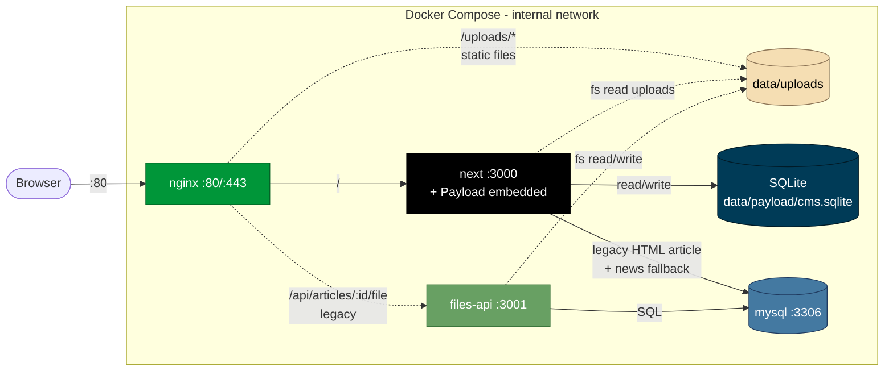

<div align="center">


# Aviation College

**Офіційний сайт авіаційного коледжу — Next.js 16, React 19, PayloadCMS 3, Docker.**

<br />

[](https://nextjs.org)
[](https://react.dev)
[](https://payloadcms.com)
[](https://www.typescriptlang.org)
[](https://tailwindcss.com)
[](https://www.sqlite.org)
[](https://www.mysql.com)
[](https://docs.docker.com/compose/)

<br />


</div>

---

## Зміст

- [Огляд](#огляд)
- [Технологічний стек](#технологічний-стек)
- [Архітектура](#архітектура)
- [Сховище контенту](#сховище-контенту)
- [Швидкий старт](#швидкий-старт)
- [Структура проєкту](#структура-проєкту)
- [Змінні середовища](#змінні-середовища)
- [Скрипти](#скрипти)
- [Деплой](#деплой)
- [Статус і наступні роботи](#статус-і-наступні-роботи)

---

## Огляд

Корпоративний сайт авіаційного коледжу з публічними розділами та вбудованою адмінкою для модерації контенту.

| Розділ | Опис |
|---|---|
| **Новини** | `/news` + `/news/:id` — повністю з PayloadCMS (1268 одиниць) |
| **Документи** | `/documents/:id` — PDF-документи в PayloadCMS (5178 одиниць) |
| **Старі статті** | `/article/:id` — 302-redirect на `/documents/:id` для мігрованих PDF, інакше legacy HTML-рендер з MySQL |
| **Курси / Part-147** | Програми навчання |
| **Абітурієнтам / Студентам / Викладачі** | Статичні розділи з нативним контентом |
| **Адмін** | `/admin` (PayloadCMS) — модерація новин і документів |

<div align="center">
  
  &nbsp;
  
</div>

---

## Технологічний стек

<table>
<tr>
  <td><b>Frontend</b></td>
  <td>Next.js 16 (App Router) · React 19 · TypeScript 5 · Tailwind CSS 4 · Radix UI · lucide-react</td>
</tr>
<tr>
  <td><b>CMS</b></td>
  <td>PayloadCMS 3.84 (embedded) · Lexical editor · SQLite (libsql) · uk + en locales</td>
</tr>
<tr>
  <td><b>Backend (Next)</b></td>
  <td>Server Components · API routes · Payload local API · <code>mysql2</code> для legacy-фолбеків</td>
</tr>
<tr>
  <td><b>Files API</b></td>
  <td>Express 4 (<code>services/files-api/</code>) · multer · обслуговує hardcoded <code>/api/articles/:id/file</code> покликання на старі PDF</td>
</tr>
<tr>
  <td><b>Сховище</b></td>
  <td>SQLite (Payload, <code>data/payload/cms.sqlite</code>) · MySQL 8.4 (legacy <code>articles_v2</code>) · bind-mount uploads</td>
</tr>
<tr>
  <td><b>Edge / Reverse proxy</b></td>
  <td>nginx 1.27-alpine · віддає <code>/uploads/*</code> напряму з диска · проксіює <code>/</code> у next</td>
</tr>
<tr>
  <td><b>Інфраструктура</b></td>
  <td>Docker Compose · Hetzner KVM (Ubuntu 26.04 LTS) · Let's Encrypt (TODO)</td>
</tr>
</table>

---

## Архітектура



**Ключові потоки:**

1. **Новини** — `/news` і `/news/:id` читають винятково з Payload SQLite через `getPayload({ config }).find(...)`. Колекція `news` у `src/collections/News.ts`.
2. **Документи** — `/documents/:id` читає Payload Document по ID. Колекція `documents` у `src/collections/Documents.ts`, `category: select hasMany` з ~30 опцій + `subcategory: text` для пошуку.
3. **Старі URL `/article/:id`** — спочатку шукають Payload Document з `legacyId={id}` → 302-redirect на `/documents/:newId`. Якщо нема — фолбек на legacy MySQL `articles_v2` HTML-рендер.
4. **Адмін** — PayloadCMS на `/admin`, REST API на `/api/payload/*`. Аутентифікація через колекцію `Users`.

---

## Сховище контенту

| Тип | Кількість | Сховище | Шлях у БД / на диску |
|---|---|---|---|
| Новини | 1268 | Payload SQLite | колекція `news`, картинки в `/uploads/news-images/` |
| Документи (PDF) | 5178 | Payload SQLite + bind-mount | колекція `documents`, файли в `/uploads/payload/documents/` |
| Legacy HTML-статті | 1328 | MySQL `articles_v2` | `view_mode IN ('html','docx_to_html')`, файли в `/uploads/articles/*.html` |
| Legacy MySQL `news_v2` | 1268 | MySQL | **дублікат**, не читається — заплановано до видалення |
| Legacy `news` / `articles` (BLOB) | — | MySQL | історичні таблиці зі старого сервера, не читаються |

**Чому гібрид:** Payload використовує SQLite, MySQL досі активний для legacy HTML-сторінок (`/article/X` коли немає мігрованого Document). Жодних cross-DB join'ів — кожен роут явно обирає сховище.

---

## Швидкий старт

### Передумови

- Node.js **22+**
- (Опційно) Доступ до прод MySQL для legacy HTML-сторінок — або зніміть snapshot SQLite з прода

### Локальний запуск

```bash
git clone git@github.com:ihor-soloviov/aviation-college.git
cd aviation-college
npm install
cp .env.example .env.local
# відредагувати .env.local — підставити PAYLOAD_SECRET, DATABASE_URI, MYSQL_*
npm run dev
```

При першому запуску Payload автоматично пушить схему в локальний `data/payload/cms.sqlite`. Відкриваєш:

- Сайт: <http://localhost:3000>
- Адмін: <http://localhost:3000/admin> (перший адмін створюється GUI'ем)

### Підтягнути реальні дані з прода

```bash
# 1. Безпечний snapshot SQLite через VACUUM INTO (працює на живій БД)
ssh aviation 'cd /home/deploy/aviation && docker compose --env-file .env.production exec -T next sh -c "sqlite3 /app/data/payload/cms.sqlite \"VACUUM INTO '\''/app/data/payload/snapshot.sqlite'\''\""'

# 2. Стягнути локально
rsync -avz --progress aviation:/home/deploy/aviation/data/payload/snapshot.sqlite \
  ./data/payload/cms.sqlite
rsync -avz --progress aviation:/home/deploy/aviation/data/uploads/news-images/ \
  ./data/uploads/news-images/
rsync -avz --progress aviation:/home/deploy/aviation/data/uploads/payload/documents/ \
  ./data/uploads/payload/documents/

# 3. Прибрати snapshot на сервері
ssh aviation 'rm /home/deploy/aviation/data/payload/snapshot.sqlite'
```

У `.env.local` додати `UPLOAD_MODE=local` та `UPLOADS_DIR=$(pwd)/data/uploads`, щоб роут `/uploads/[...path]` віддав картинки.

---

## Структура проєкту

```
aviation-college/
├── src/
│   ├── app/
│   │   ├── (frontend)/        # публічні роути — group без префіксу URL
│   │   │   ├── news/[id]/     # детальна сторінка новини (Payload)
│   │   │   ├── documents/[id]/ # детальна сторінка документа (Payload)
│   │   │   ├── article/[id]/  # legacy → 302 на /documents/:newId, або HTML
│   │   │   ├── uploads/[...]/ # local static serve для UPLOAD_MODE=local
│   │   │   └── …
│   │   ├── (payload)/         # роути Payload — /admin та /api/payload
│   │   └── api/news/          # публічний REST для load-more
│   ├── collections/           # схеми Payload: News, Documents, Media, Users
│   ├── blocks/                # блоки для News rich-content
│   ├── components/            # React UI
│   ├── lib/
│   │   ├── payload-news.ts    # хелпери для News колекції
│   │   ├── document-categories.ts # таксономія Documents (single source of truth)
│   │   ├── articles.ts        # legacy MySQL fallback для HTML-статей
│   │   └── …
│   └── scripts/migration/     # одноразові скрипти міграції (зберігаємо для довідки)
│       ├── migrate-news.ts          # legacy news_v2 → Payload News
│       ├── migrate-articles.ts      # articles_v2 PDF → Payload Documents
│       ├── extract-categories.ts    # аналіз hub-сторінок
│       ├── normalize-categories.ts  # розподіл по top-категоріях
│       └── parse-html.ts            # парсер HTML у Payload blocks
├── services/files-api/        # Express для hardcoded /api/articles/:id/file
├── data/                      # bind-mount; у .gitignore
│   ├── payload/cms.sqlite     # Payload data
│   ├── uploads/{news-images,payload,articles,…}
│   └── mysql/
├── nginx/conf.d/aviation.conf
├── docker-compose.yml
├── Dockerfile
├── payload.config.ts          # конфігурація Payload
└── docs/
    ├── deploy.md              # операційний посібник
    └── future-work.md         # наступні задачі
```

---

## Змінні середовища

### `.env.local` (локалка)

| Змінна | Приклад | Опис |
|---|---|---|
| `PAYLOAD_SECRET` | `<random hex>` | Секрет Payload (для cookie signing). Обов'язково. |
| `DATABASE_URI` | `file:./data/payload/cms.sqlite` | Шлях до Payload SQLite. |
| `UPLOAD_MODE` | `local` | Якщо `local` — роут `/uploads/[...path]` віддає з диска. |
| `UPLOADS_DIR` | `$PWD/data/uploads` | Корінь uploads (для роуту + для Payload `staticDir`). |
| `MYSQL_HOST` / `_PORT` / `_USER` / `_PASSWORD` / `_DATABASE` | — | Лише для legacy HTML-сторінок (`/article/:id` фолбек). Не обов'язкові якщо не тестуєш HTML-articles. |
| `FILES_API_URL` | `http://204.168.161.68` | Для `lib/files-url.ts`; SSR-fetch старих файлів. |

### `.env.production` (на сервері)

Див. [`.env.production.example`](./.env.production.example). Ключові:

- `PAYLOAD_SECRET`, `DATABASE_URI=file:/app/data/payload/cms.sqlite` — Payload.
- `UPLOADS_DIR=/var/www/uploads` — спільний bind-mount між next і nginx.
- `MYSQL_*` — для legacy `articles_v2` та `news_v2`.
- `FILES_API_URL=http://files-api:3001` — SSR з контейнера через docker-мережу.
- `NEXT_PUBLIC_FILES_API_URL=http://204.168.161.68` — браузер через nginx.
- `FILES_API_UPLOAD_TOKEN`, `CORS_ORIGINS` — для files-api.

> **Важливо:** `NEXT_PUBLIC_*` запікаються у клієнтський бандл під час `next build`. Зміна потребує перебілду образу.

---

## Скрипти

| Команда | Що робить |
|---|---|
| `npm run dev` | Dev-сервер на :3000 з HMR. Payload автоматично пушить схему в SQLite. |
| `npm run build` | Прод-білд (Turbopack). |
| `npm start` | Прод-сервер на :3000. Schema push **вимкнено** у prod-режимі. |
| `npm run lint` | ESLint. |

### Міграційні скрипти

```bash
# News (idempotent, ~3:30 для повного прогону)
node --env-file=.env.local node_modules/.bin/tsx src/scripts/migration/migrate-news.ts

# Articles PDF → Documents (idempotent, ~1:30 для 5178 PDF)
node --env-file=.env.local node_modules/.bin/tsx src/scripts/migration/migrate-articles.ts

# Env vars: MIGRATION_LIMIT=N, MIGRATION_IDS=1,2,3, MIGRATION_DRY_RUN=1
```

Більше деталей у [`docs/deploy.md`](docs/deploy.md) та [`docs/future-work.md`](docs/future-work.md).

---

## Деплой

Прод-стек живе на Hetzner KVM (Helsinki), IP **`204.168.161.68`**, ssh-alias `aviation`.

```bash
# З локального репо:
./scripts/deploy.sh                  # бекап SQLite + git pull + ребілд + рестарт nginx + health-check
./scripts/deploy.sh feature-branch   # вказати конкретну гілку
```

Деталі команд, layout-у і Etap 4 (домен+SSL) — у [`docs/deploy.md`](docs/deploy.md).

---

## Статус і наступні роботи

| Етап | Стан |
|---|---|
| Міграція БД зі старого сервера | ✅ |
| Docker compose стек (next + mysql + nginx + files-api) | ✅ |
| PayloadCMS embedded на проді | ✅ |
| Міграція новин 1268 → Payload | ✅ |
| Міграція статей-PDF 5178 → Payload Documents | ✅ |
| `/article/:id` → redirect на `/documents/:newId` | ✅ |
| Legacy HTML-статті (1328) — рішення | ⏳ deferred |
| `/api/articles/:id/file` — старі покликання у статичних сторінках | ⏳ |
| Видалення `data/uploads/articles/*.pdf` після cutover | ⏳ |
| Дроп таблиці `news_v2` (orphan) | ⏳ |
| Перехід зі schema-push трюку на `payload migrate` | ⏳ |
| Домен + SSL (Let's Encrypt, Etap 4) | ⏳ in progress |
| Оновлення `multer@1.x` (CVE) | ⏳ todo |

Повний перелік з обґрунтуваннями — у [`docs/future-work.md`](docs/future-work.md).

---

<div align="center">
  <sub>Built with care — Next.js 16 · React 19 · PayloadCMS 3 · TypeScript 5 · Docker</sub>
</div>
