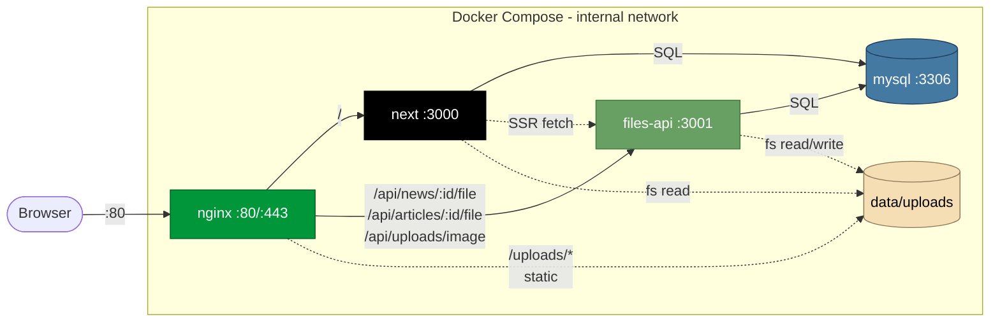

<div align="center">


# Aviation College

**Офіційний сайт авіаційного коледжу — Next.js 16, React 19, MySQL, Docker.**

<br />

[](https://nextjs.org)
[](https://react.dev)
[](https://www.typescriptlang.org)
[](https://tailwindcss.com)
[](https://www.mysql.com)
[](https://docs.docker.com/compose/)
[](https://nginx.org)

<br />


</div>

---

## Зміст

- [Огляд](#огляд)
- [Технологічний стек](#технологічний-стек)
- [Архітектура](#архітектура)
- [Швидкий старт](#швидкий-старт)
- [Структура проєкту](#структура-проєкту)
- [Змінні середовища](#змінні-середовища)
- [Скрипти](#скрипти)
- [Деплой](#деплой)
- [Статус](#статус)

---

## Огляд

Корпоративний сайт авіаційного коледжу з публічними розділами для абітурієнтів і студентів:

| Розділ | Опис |
|---|---|
| **Новини** | Стрічка новин із MySQL, контент у HTML/PDF із files-api |
| **Курси** | Програми навчання, Part-147 інформація |
| **Абітурієнтам** | Умови вступу, вступна кампанія |
| **Студентам** | Стипендії, кодекс, факультативи, наукова робота |
| **Викладачі** | Профілі, контакти |
| **Про нас / Контакти** | Загальна інформація |

<div align="center">
  
  &nbsp;
  
</div>

---

## Технологічний стек

<table>
<tr>
  <td><b>Frontend</b></td>
  <td>Next.js 16 (App Router) · React 19 · TypeScript 5 · Tailwind CSS 4 · Radix UI · lucide-react</td>
</tr>
<tr>
  <td><b>Backend (Next)</b></td>
  <td>Server Components · API routes · <code>mysql2</code> connection pool</td>
</tr>
<tr>
  <td><b>Files API</b></td>
  <td>Express 4 (<code>services/files-api/</code>) · multer · віддає HTML/PDF контент та приймає uploads</td>
</tr>
<tr>
  <td><b>Сховище</b></td>
  <td>MySQL 8.4 (база <code>kknau</code>) · bind-mount uploads (<code>data/uploads/</code>)</td>
</tr>
<tr>
  <td><b>Edge / Reverse proxy</b></td>
  <td>nginx 1.27-alpine · віддає статику <code>/uploads/*</code> напряму · проксіює <code>/api/(news|articles)/:id/file</code> у files-api</td>
</tr>
<tr>
  <td><b>Інфраструктура</b></td>
  <td>Docker Compose · Hetzner KVM (Ubuntu 26.04 LTS) · Let's Encrypt (Etap 4 — у роботі)</td>
</tr>
</table>

---

## Архітектура



**Ключові потоки:**

1. **SSR контент новини** — `next` (в контейнері) → `http://files-api:3001/api/news/:id/file` напряму через docker-мережу.
2. **Браузерний запит статичного uploads** — `nginx` віддає з bind-mount `data/uploads/` без проксі.
3. **Браузерний запит на динамічний `/file`** — `nginx` проксіює у `files-api`.

---

## Швидкий старт

### Передумови

- Node.js **22+**
- Доступ до MySQL із базою `kknau` (локально або через ssh-тунель)
- Опційно: працюючий `files-api` (локальний або віддалений) для рендеру контенту новин/статей

### Локальний запуск

```bash
git clone git@github.com:ihor-soloviov/aviation-college.git
cd aviation-college
npm install
cp .env.example .env.local
# відредагувати .env.local — підставити MYSQL_* та FILES_API_URL
npm run dev
```

Відкрити **<http://localhost:3000>**.

### Прод-білд локально

```bash
npm run build
npm start
```

---

## Структура проєкту

```
aviation-college/
├── src/
│   ├── app/              # Next.js App Router (routes, layout, globals)
│   │   ├── api/          # API routes (news, articles)
│   │   ├── news/         # /news, /news/[id]
│   │   ├── article/      # /article/[id]
│   │   ├── courses/      # Програми навчання
│   │   ├── students/     # Розділи для студентів
│   │   ├── teachers/     # Викладачі
│   │   ├── admitions/    # Вступна кампанія
│   │   ├── entrants/     # Абітурієнтам
│   │   ├── about-us/     # Про коледж
│   │   ├── contacts/     # Контакти
│   │   └── part-147/     # Part-147 інформація
│   ├── components/       # React-компоненти (UI, layout, common)
│   ├── hooks/            # Кастомні React-хуки
│   ├── lib/              # SQL, file utils, helpers
│   └── types/            # Спільні TS типи
├── services/
│   └── files-api/        # Express-сервіс для HTML/PDF контенту та uploads
├── nginx/conf.d/         # Конфігурація reverse proxy
├── data/                 # Bind-mount: mysql/, uploads/, legacy/ (в .gitignore)
├── public/               # Статичні асети (hero-зображення, логотипи, іконки)
├── docker-compose.yml    # 4 сервіси: mysql, next, files-api, nginx
├── Dockerfile            # Multi-stage білд для next
└── next.config.ts        # Next config (rewrites, images)
```

---

## Змінні середовища

### `.env.local` (локалка)

| Змінна | Приклад | Опис |
|---|---|---|
| `MYSQL_HOST` | `195.54.163.114` | Хост MySQL |
| `MYSQL_PORT` | `3306` | Порт |
| `MYSQL_USER` | `aviation` | Користувач БД |
| `MYSQL_PASSWORD` | `***` | Пароль |
| `MYSQL_DATABASE` | `kknau` | Назва БД |
| `UPLOADS_DIR` | `/var/www/uploads` | Шлях до uploads (для SSR fs-read) |
| `FILES_API_URL` | `http://204.168.161.68` | Base URL files-api для SSR |
| `NEXT_PUBLIC_FILES_API_URL` | `http://204.168.161.68` | Base URL files-api для браузера |

### `.env.production` (на сервері)

Див. [`.env.production.example`](./.env.production.example). Ключові відмінності:

- `FILES_API_URL=http://files-api:3001` — SSR з контейнера ходить у внутрішню docker-мережу.
- `NEXT_PUBLIC_FILES_API_URL=http://204.168.161.68` — браузер ходить через nginx.
- `CORS_ORIGINS=http://localhost:3000,http://204.168.161.68` — список origins для files-api.
- `MYSQL_ROOT_PASSWORD`, `FILES_API_UPLOAD_TOKEN` тощо.

> **Важливо:** `NEXT_PUBLIC_*` запікаються у клієнтський бандл під час `next build`. Зміна потребує перебілду образу.

---

## Скрипти

| Команда | Що робить |
|---|---|
| `npm run dev` | Dev-сервер на :3000 з HMR |
| `npm run build` | Прод-білд |
| `npm start` | Прод-сервер на :3000 |
| `npm run lint` | ESLint |

---

## Деплой

Прод-стек живе на Hetzner KVM (Helsinki), IP **`204.168.161.68`**, ssh-alias `aviation`.

```bash
ssh aviation
cd /home/deploy/aviation
git pull
docker compose --env-file .env.production up -d --build
```

### Корисні команди на сервері

```bash
docker compose --env-file .env.production ps                  # стан контейнерів
docker compose --env-file .env.production logs -f next        # логи next
docker compose --env-file .env.production logs -f files-api   # логи files-api
docker compose --env-file .env.production exec nginx nginx -s reload
```

### Layout на сервері

```
/home/deploy/aviation/
├── (git checkout)
└── data/
    ├── mysql/             # bind mount → mysql:/var/lib/mysql
    ├── uploads/           # bind mount → next:/var/www/uploads, files-api:/var/www/uploads
    ├── legacy/            # ro для next (старі ресурси)
    ├── letsencrypt/       # certbot certs
    └── certbot-webroot/   # ACME challenge
```

---

## Статус

| Етап | Стан |
|---|---|
| Міграція БД зі старого сервера | done |
| Міграція файлів (uploads, legacy) | done |
| Docker compose стек (next + mysql + nginx) | done |
| files-api у compose + nginx proxy | done |
| Домен + SSL (Let's Encrypt) | **in progress** |
| Адмін / CMS (Payload) | **paused** до повного провіжену сервера |
| Оновлення `multer@1.x` (critical CVE) | **todo** |

---

<div align="center">
  <sub>Built with care — Next.js 16 · React 19 · TypeScript 5 · Docker</sub>
</div>
